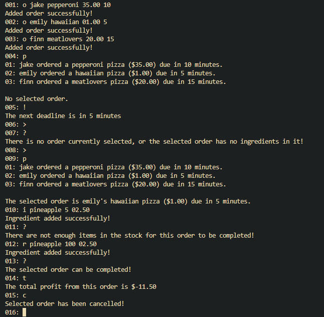

# CunkyPizzeria
## A Pizzeria management system built on C
### Developed for the university assignment (CSPizzeria)

## Description
This C application helps to manage a pizzeria using linked lists to efficiently depict notate and all their details.  It also notates all the ingredients required along with the amount corresponding to the order and unit price.  It then cross compares this to the pizzerias stocked ingredients.  Orders can be completed and pizzeria stock updated.

As mentioned the tool implements linked lists and structs in the C language.  Furthermore the following C libraries are included: stdio.h, stdlib.h and string.h.  This project is simple and was just intended to familiarise myself with the linked list data structure.  The data structure used in this project is illustrated below:

Here are some screenshots demonstrating the operation of the application.

## Installation and Operation Instructions
### Installation
1. Clone the Repository
2. Compile pizzeria.c and main.c using your compiler, for example using gcc (assuming it is installed on your system): `dcc -o cunkypizzeria pizzeria.c main.c`\
3. Run the executable: `./cunkypizzeria`

### Operation

## Credits
University Course Administrators (not listed to avoid academic misconduct) for providing the assignment concept and starter code.
